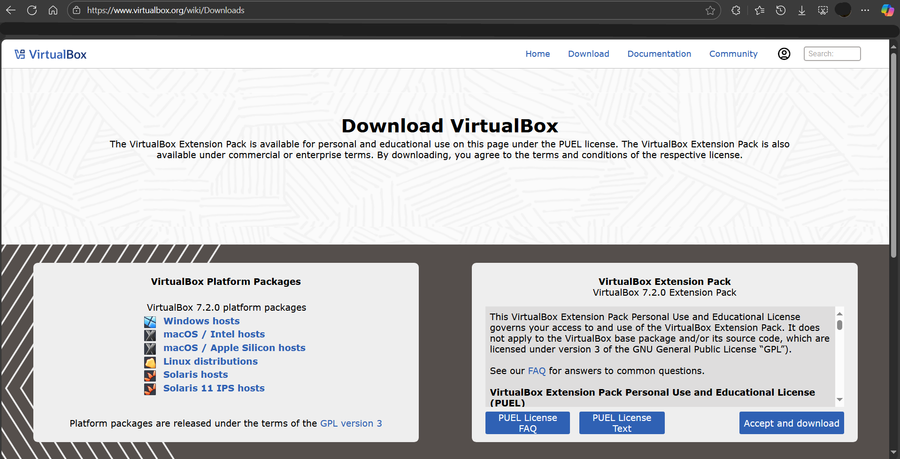

# Oracle VirtualBox Setup

## Overview
This guide shows how I installed and configured **Oracle VirtualBox** on my host system for my Home SOC Lab.

---

## Step 1: Download VMB Software from website.
- VirtualBox: [Download Here](https://www.virtualbox.org/wiki/Downloads)
- VirtualBox Extension Pack: [Download Here](https://www.virtualbox.org/wiki/Downloads)

---

## Install VirtualBox
1. Run the installer and accept defaults (or customize as needed).
2. Allow network interface installation if prompted.
3. Finish and launch VirtualBox.

# _Oracle VMB setup is now complete!_

---

[Back to Projects Repo](https://cscdanielj.github.io/projects/home-soc-lab-setup.html)
