<section class="section">
  <div class="container">
    <div class="grid">


# 🐧 Ubuntu VM Lab

This guide walks through setting up an **Ubuntu 20.04.6 virtual machine** in Oracle VirtualBox to be used as part of a home SOC lab.  
Each step includes notes and placeholders for screenshots you will upload later.

---

## Step 1: Download Ubuntu ISO
Download the official Ubuntu 20.04.6 ISO from the Ubuntu website.  
[Ubuntu ISO Download](https://www.releases.ubuntu.com/focal/ubuntu-20.04.6-desktop-amd64.iso)

---

## Step 2: Create New VM
Launch Oracle VirtualBox Manager and click **New** to create a virtual machine.

Follow along with the images to complete the setup.  
 
  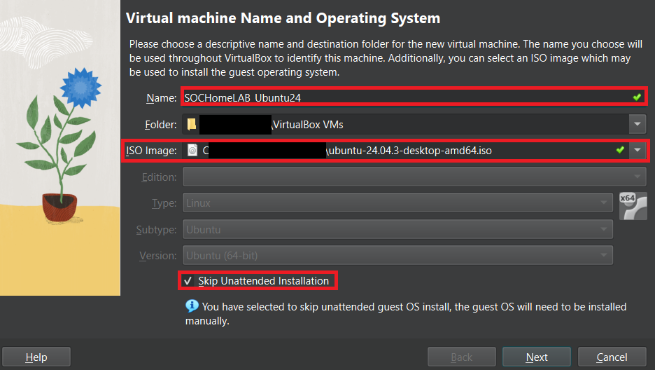
 
  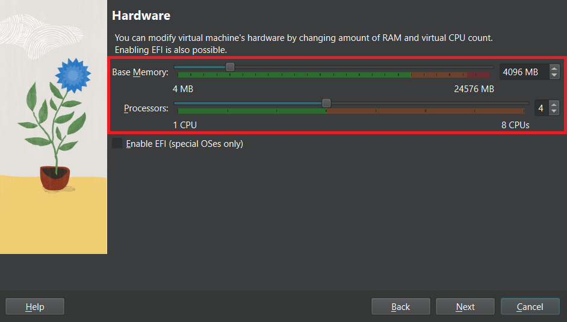
  
  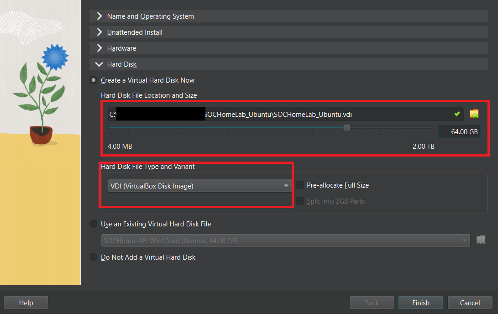

- After setup is complete, click "Finish"

---

## Step 3: Network Settings
Select the Ubuntu VM’s **Settings → Network**.  

  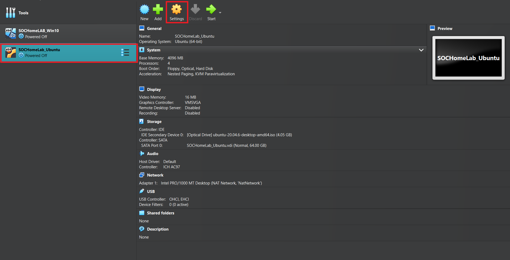
Configure the following network settings.
    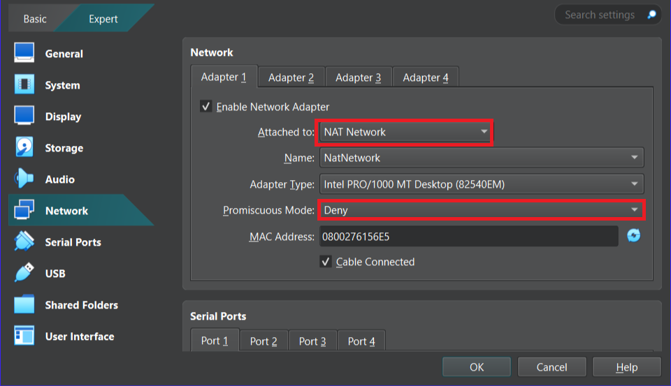

---

## Step 4: Installing Ubuntu on VM
1. Launch the Ubuntu VM.  
2. Follow through the Ubuntu installation process.  
3. Use the following 9 screenshots as a guide for each step.  

  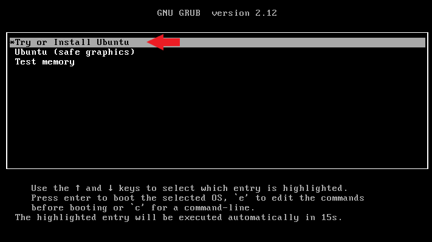 
  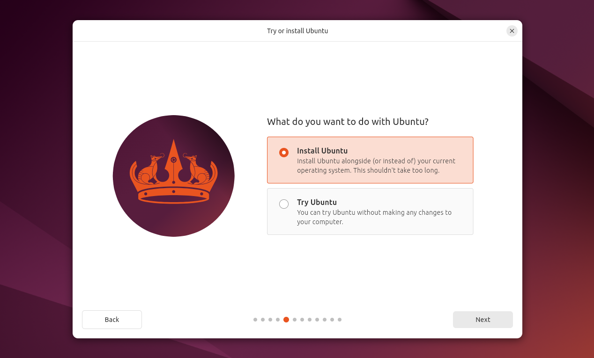
  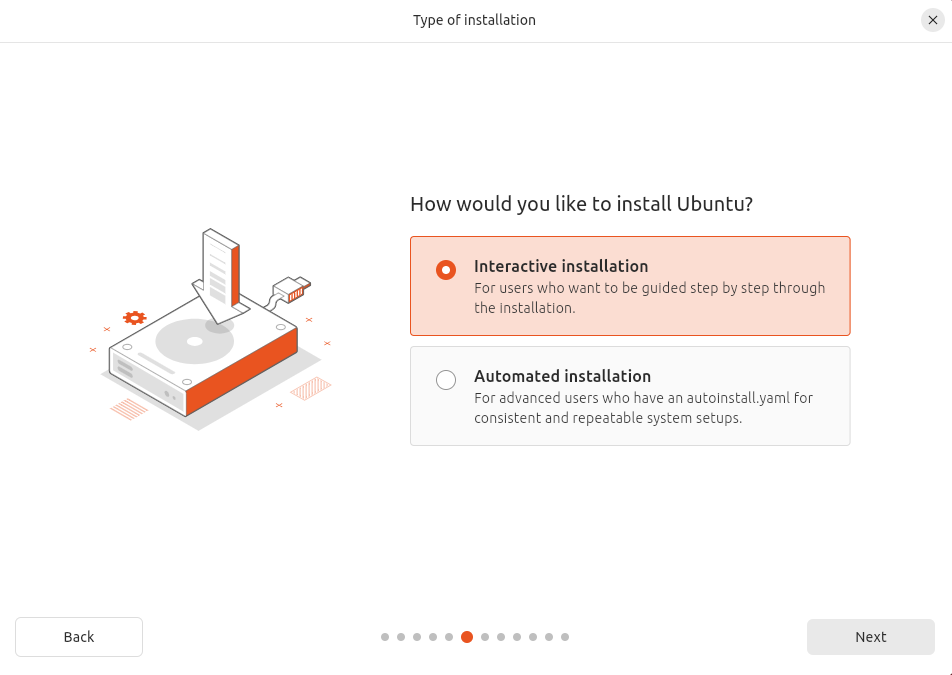
  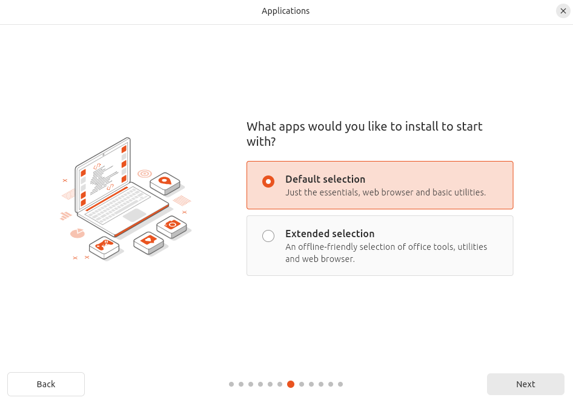
  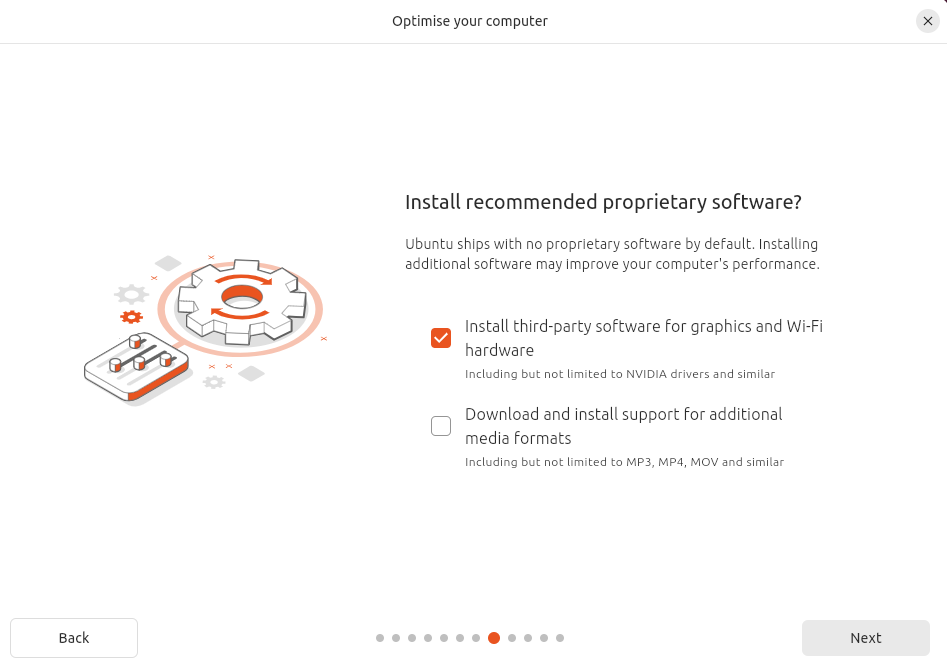
  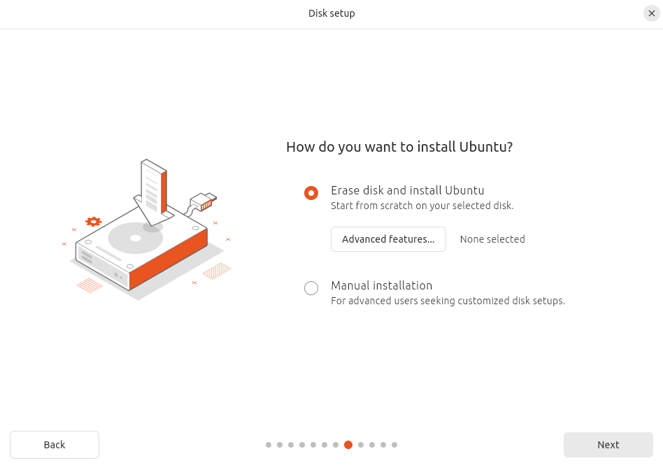
  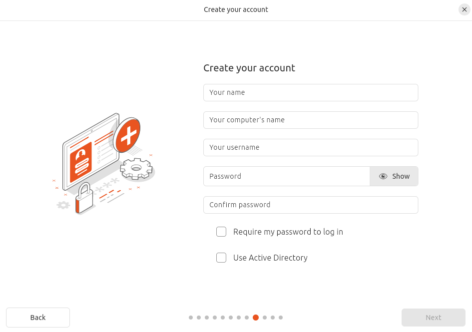
  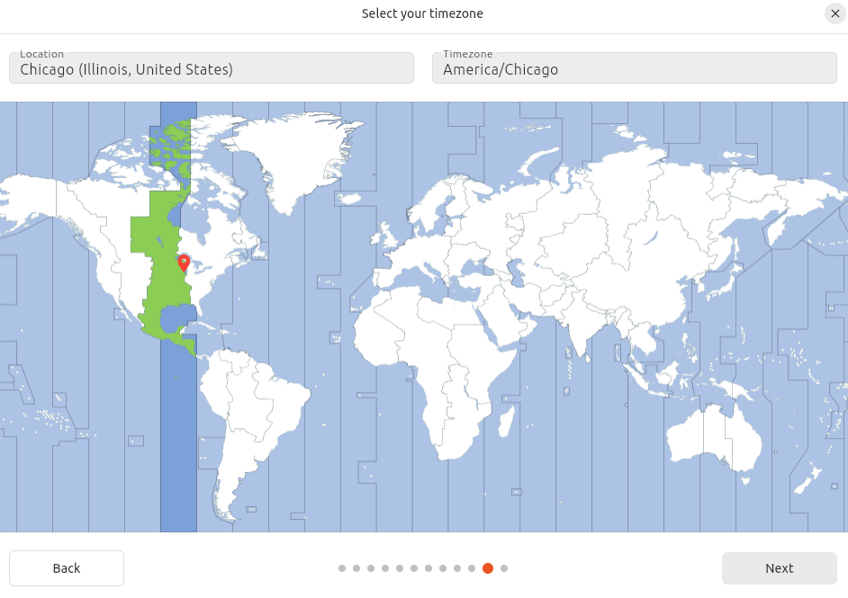
  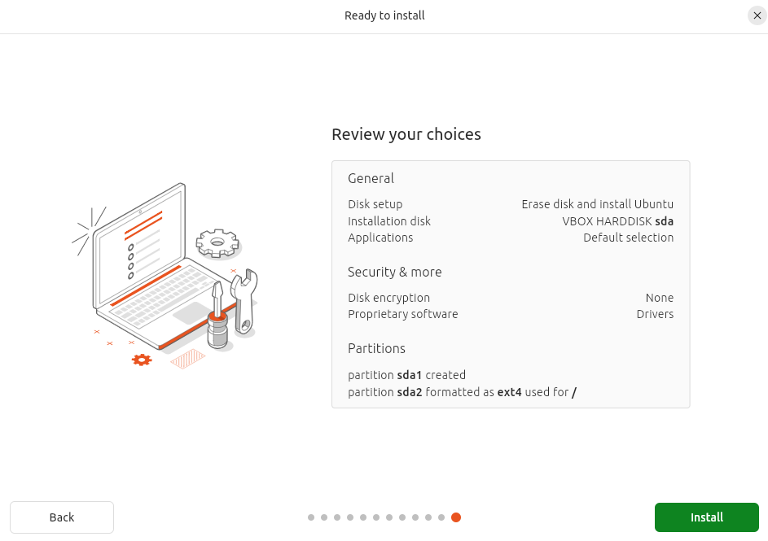

✅ Once completed, Ubuntu is now fully installed on the VM.

---

## Step 5: Update and Prepare Your VM
After installation, open the terminal in Ubuntu and run the following commands to update, upgrade, and install essential tools:

```bash
sudo apt update && sudo apt upgrade -y
sudo apt install curl git ufw -y
