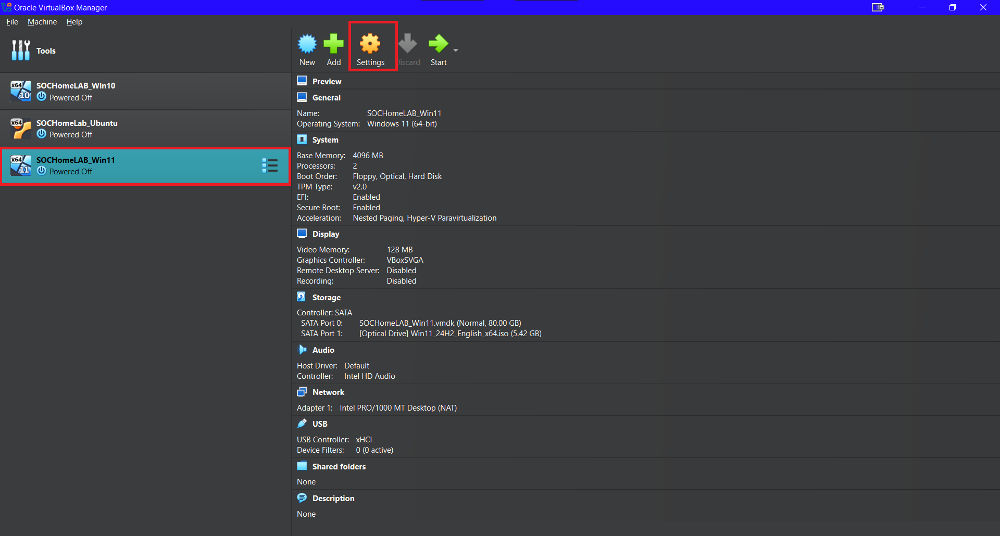
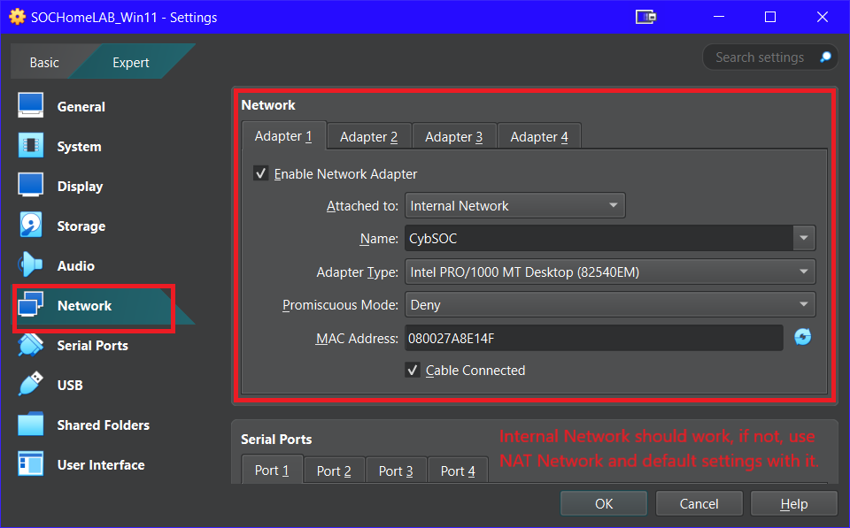

# Windows 11 VM Lab

This guide walks through setting up a **Windows 11 virtual machine** in Oracle VirtualBox to be used as part of a home SOC lab.  

---

- ## Step 1: Download Windows 11 ISO
Download the official Windows 11 ISO from Microsoft.  
- In order to get the Windows 11 ISO you will have to first install the [Windows 10 Media Creation Tool.](https://www.microsoft.com/en-us/software-download/windows11)  
- It will then bring you to a screen that says "Getting a Few Things Ready"  
- After accepting the Notices and Licensing Terms, choose "Create installation media (USB flash drive, DVD, or ISO file) for another PC.
- Choose your language and PC Architecture and select the box "Use the recommended options for this PC"
- On your next prompt, you will choose ISO file and save it to your chosen location on your PC.

---

- ## Step 2: Create New VM
- Launch Oracle VirtualBox Manager and click **New** to create a virtual machine.

- Follow along with the images to complete the setup.  


- After setup is complete, click **Finish**.

---

- ## Step 3: Network Settings
- Select the Windows 11 VM’s **Settings → Network**.  



- Configure the following network settings.     



---

- ## Step 4: Installing Windows 11 on VM
- Start the **Windows 11 VM**.  
- Boot from the ISO and proceed through the Windows setup.  
- Use the following screenshots as a guide for each step.  


- Select "I dont have a Product Key"


- Choose which Windows 11 Version you need.


✅ Once completed, Windows 11 is now fully installed on the VM.

---

- ## Step 5: Post-Install Updates & Prep
- After installation, run Windows Update until fully updated.  
- (Optional) Install **VirtualBox Guest Additions** for better display/input.  
- (Optional) Prepare for SOC tooling (you can add your exact steps later).

```powershell
# Run in PowerShell (as Administrator) as needed later in your lab
# Placeholder for tools you plan to use:
# e.g., Enable script execution temporarily (if required by your tools)
Set-ExecutionPolicy -ExecutionPolicy RemoteSigned -Scope CurrentUser -Force
```
[Return to Projects Repo](https://cscdanielj.github.io/projects/home-soc-lab-setup.html)
