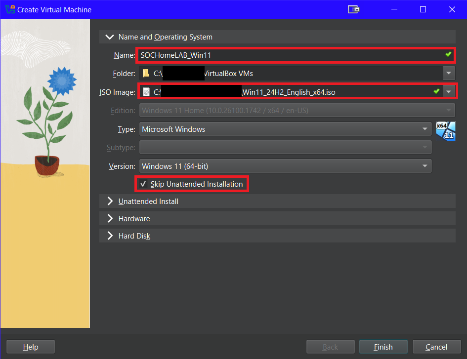
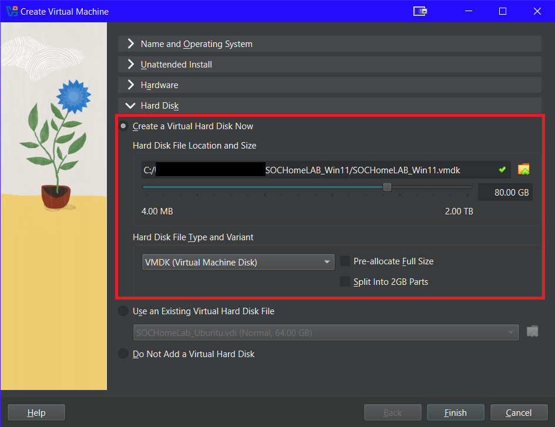

# Windows 11 VM Lab

This guide walks through setting up a **Windows 11 virtual machine** in Oracle VirtualBox to be used as part of a home SOC lab.

---

- ## Step 1: Download Windows 11 ISO
Download the official Windows 11 ISO from Microsoft:  
[Windows 11 ISO Download](https://www.microsoft.com/en-us/software-download/windows11)

---

- ## Step 2: Create New VM
- Launch **Oracle VirtualBox Manager** and click **New** to create a virtual machine.
- Follow along with the images to complete the setup.

- After setup is complete, click **Finish**.

---

- ## Step 3: Network Settings
- Select the Windows 11 VM’s **Settings → Network**.

- Configure the following network settings.

---

- ## Step 4: Installing Windows 11 on VM
- Start the **Windows 11 VM**.
- Boot from the ISO and proceed through the Windows setup.
- Use the following screenshots as a guide for each step.

- Select **“I don’t have a product key.”**

- Choose the Windows 11 edition you need.

- After Windows 11 completes the installation process, the system will reboot.
- After the reboot, continue with the Windows Out-of-Box Experience (OOBE).

**Bypass network/account requirement (if needed):**  
On the **Select country or region** screen, press **Shift + F10** to open Command Prompt.  
Run: OOBE\BYPASSNRO

The system will reboot and let you continue with a local account.

- Complete the **Local Account** setup.

---

Once completed, Windows 11 is now fully installed on the VM.
Go through and complete the rest of the account settings to fit your needs.  

---

- ## Step 5: Post-Install Updates & Prep
- Run **Windows Update** until fully updated.  
- *(Optional)* Install **VirtualBox Guest Additions** for better display/input.  
- *(Optional)* Prepare for SOC tooling (you can add your exact steps later).

## Run in PowerShell as Administrator, if needed by your tooling:
Set-ExecutionPolicy -ExecutionPolicy RemoteSigned -Scope CurrentUser -Force

# _✅Enjoy your new Windows 11 VM_ #

[Return to Projects Repo](https://cscdanielj.github.io/projects/home-soc-lab-setup.html)
